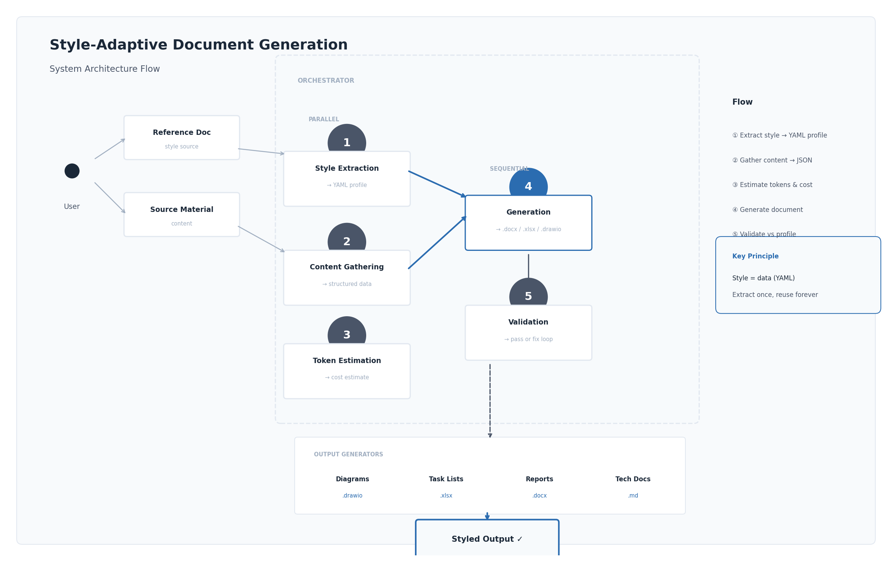

# Style-Adaptive Document Generation

> Feed it a reference document. It learns the style. It generates new documents that match exactly.

## What This Is

An AI agent skill that **extracts visual and writing style from any reference document**, then generates new documents (reports, diagrams, task lists, technical docs) in that exact style.

No hardcoded templates. No manual style guides. The reference document IS the style guide.

## How It Works

```
Reference Doc ──▶ Style Analyzer ──▶ Style Profile (YAML) ──▶ Generator ──▶ Styled Output
```

Feed it an enterprise report → generates enterprise-styled output.
Feed it a startup's docs → generates startup-styled output.
Feed it any company's format → matches it.

## Features

| Feature | Description |
|---------|-------------|
| Style Analyzer | Extracts colors, fonts, tables, prose rules, structure from any doc |
| Sub-Agent Orchestrator | Decomposes large docs into parallel sub-tasks |
| Token Calculator | Estimates tokens and cost before generation |
| Multiple Generators | Diagrams, task lists, reports, technical docs |
| Style Profiles | Portable YAML — extract once, reuse forever |

## Architecture



See [`architecture/system-flow.drawio`](./architecture/system-flow.drawio) for the editable version.

```
ORCHESTRATOR (routes and coordinates)
│
├─ Sub-Agent: STYLE EXTRACTION
│  Reads reference doc → produces style profile YAML
│
├─ Sub-Agent: CONTENT GATHERING  
│  Reads source material → extracts facts/metrics/config
│
├─ Sub-Agent: GENERATION
│  Style profile + content → document output
│
└─ Sub-Agent: VALIDATION
   Compares output vs profile → flags deviations
```

## Quick Start

### 1. Analyze a Reference Document
```
"Analyze the style of this document and produce a style profile"
→ Provide reference doc (PDF, DOCX, HTML, screenshot)
→ Output: style-profile.yaml
```

### 2. Generate with That Style
```
"Generate a DR report for [system] using this style profile"
→ Output: styled document matching the reference exactly
```

### 3. Estimate Cost First
```bash
python tools/estimate_tokens.py --type report --pages 15 --model sonnet
# Output: ~$0.22 estimated cost
```

## Project Structure

```
style-adaptive-doc-gen/
├── README.md              ← You are here
├── SKILL.md               ← Master prompt / entry point
├── PRICING.md             ← Cost guide
├── style-analyzer.md      ← Core: style extraction prompt
├── orchestrator.md        ← Sub-agent workflow
├── token-calculator.md    ← Token estimation logic
├── generators/
│   ├── diagrams.md        ← Architecture diagrams (.drawio)
│   ├── task-lists.md      ← Project task lists (.xlsx)
│   ├── reports.md         ← Infrastructure reports (.docx)
│   └── technical-docs.md  ← System documentation (.docx/.md)
├── tools/
│   └── estimate_tokens.py ← CLI cost calculator
├── examples/
│   ├── style-profiles/    ← Sample extracted profiles
│   └── outputs/           ← Sample generated docs
└── architecture/
    └── system-flow.drawio ← Product architecture diagram
```

## Who Is This For

- Cloud engineers producing reports for multiple clients
- Consultants matching different client brand standards
- Teams wanting consistent doc quality without template libraries
- Anyone tired of manually reformatting AI output

## Design Principles

1. **Style is data, not code** — portable YAML profiles
2. **Generators are style-agnostic** — consume profiles, never hardcode
3. **Sub-agents preserve context** — parallel decomposition for large docs
4. **Cost-aware** — know the token cost before committing
5. **Validate before delivery** — output checked against profile

## License

MIT — free to use, modify, and contribute.

## Author

Chin Yong Kean — AWS 12x Certified Solutions Architect
